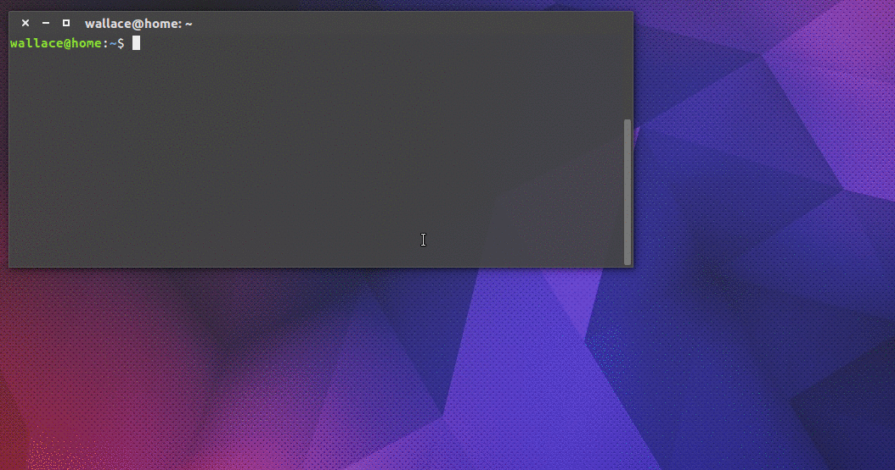

# Moov

> Stream Movies and tv shows



## Requirements

- [VLC Player][2]

## Install

You can install this:


```
$ npm i -g moov
```

or just:

```
$ git clone git@github.com:uselessdev/moov.git movies
$ cd movies
$ npm install
$ npm link
$ moov
```

## Usage:

It's simple

```
$ moov search <movie-name> [options]
```

to see options available type: `moov --help`

## License:

[MIT][3]

[1]: https://github.com/mafintosh/peerflix "Peerflix: The Salvation of the world"
[2]: http://www.videolan.org/vlc/ "VLC Player :3"
[3]: https://github.com/uselessdev/moov/blob/master/LICENSE "License"
